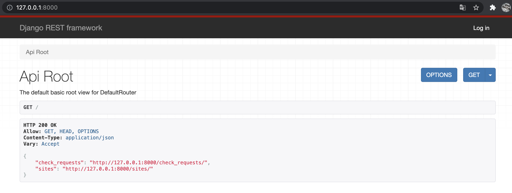
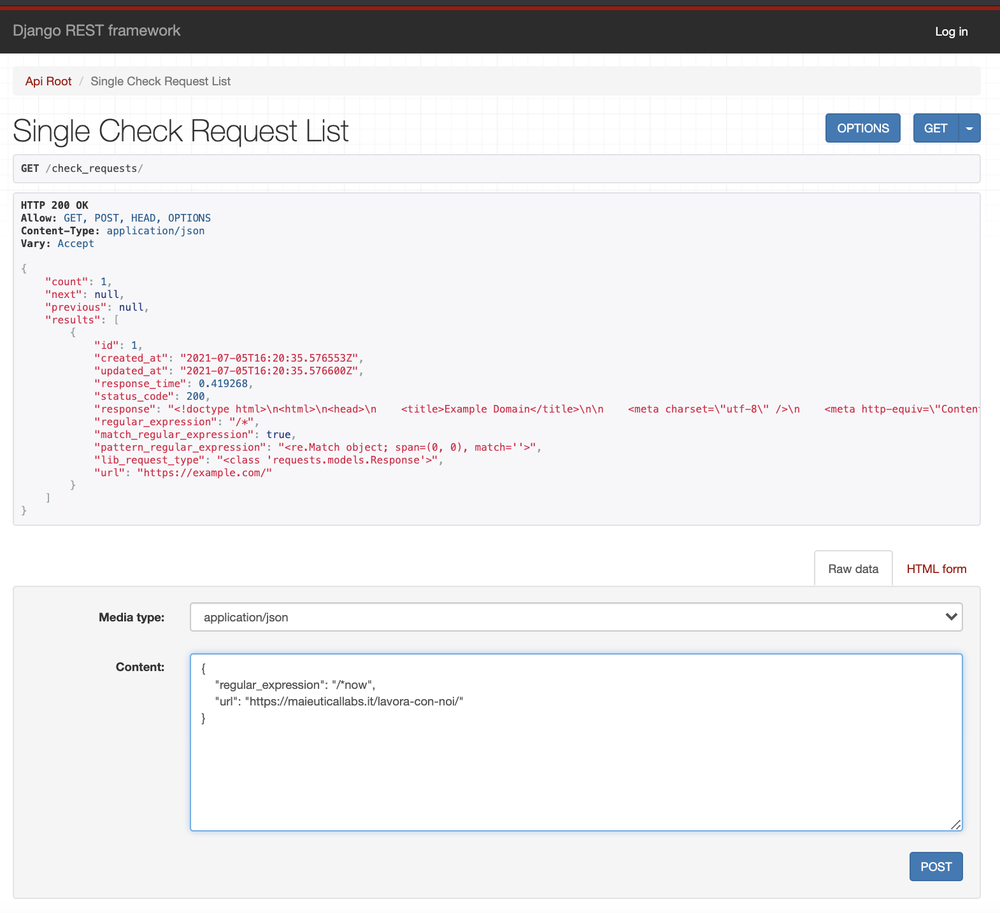
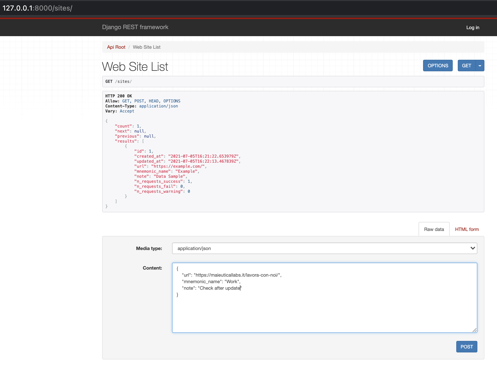
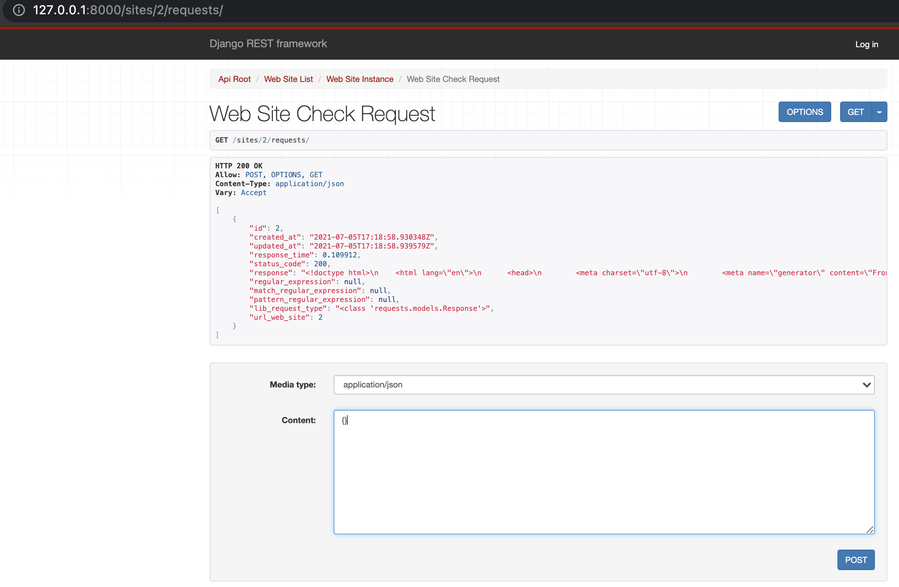
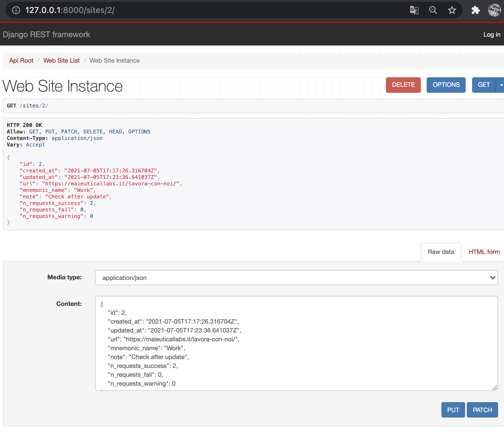
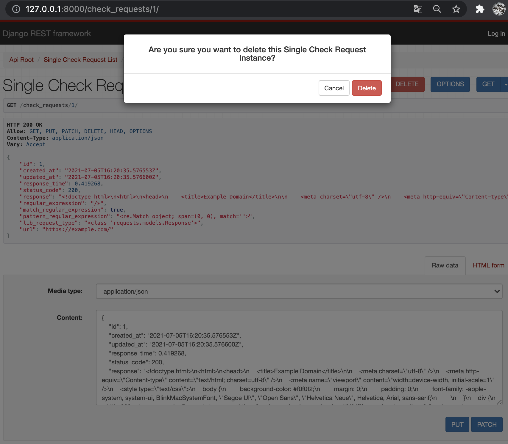
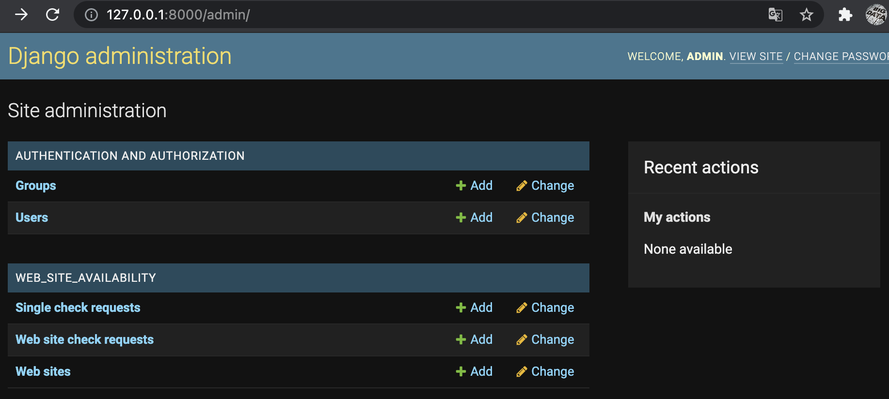

# Live 
## https://test-backend-developer.herokuapp.com/

This project has been developed for performing simple Requests.

# Basic Instructions

(Please use and activate a virtual enviroment: https://pypi.org/project/virtualenv/)

    $ virtualenv venv
    $ source venv/bin/activate
    (venv) $ pip install -r requirements.txt
    (venv) $ cd django_rest_app/app_rest

(This project is made with: https://www.django-rest-framework.org/ 
and so django commands are available.)

To start the system to monitor the availability of a
web site use the command:

    (venv) $ python manage.py runserver

Should appear:

    (venv) $ python manage.py runserver

    Watching for file changes with StatReloader
    Performing system checks...
    
    System check identified no issues (0 silenced).
    July 04, 2021 - 21:54:01
    Django version 4.0.dev20210622105104, using settings 'app_rest.settings'
    Starting development server at http://127.0.0.1:8000/
    Quit the server with CONTROL-C.

Open http://127.0.0.1:8000/ in a browser or get with curl a list of urls of the system:

    $ curl http://127.0.0.1:8000/
    {
      "check_requests":"http://127.0.0.1:8000/check_requests/",
      "sites":"http://127.0.0.1:8000/sites/",
    }

These are the top-level URLs that are reachable:
Click on http://127.0.0.1:8000/check_requests/ or run:

    $ curl -X POST http://127.0.0.1:8000/check_requests/ --data 'url=https://example.com/'
    {
      "id":1,
      "created_at":"2021-07-05T01:05:49.814210Z",
      "updated_at":"2021-07-05T01:05:49.814253Z",
      "response_time":0.717332,
      "status_code":200,
      "response":"<!doctype html>\n<html>\n<head>\n    <title>Example Domain</title>\n\n    <meta charset=\"utf-8\" />\n    <meta http-equiv=\"Content-type\" content=\"text/html; charset=utf-8\" />\n    <meta name=\"viewport\" content=\"width=device-width, initial-scale=1\" />\n        \n</head>\n\n<body>\n
\n    <h1>Example Domain</h1>\n    
This domain is for use in illustrative examples in documents. You may use this\n    domain in literature without prior coordination or asking for permission.
\n    
<a href=\"https://www.iana.org/domains/example\">More information...</a>
\n
\n</body>\n</html>\n",
      "regular_expression":null,
      "match_regular_expression":null,
      "pattern_regular_expression":null,
      "lib_request_type":"<class 'requests.models.Response'>",
      "url":"https://example.com/"
    }
or use browser interface:

in both cases it will show the check request just saved to db.
In the check request it is possible to insert the optional regex parameter asking the system to check 
if there is matching with the server response.

To make more than one request for the same url use the second link:
Click on http://127.0.0.1:8000/sites/ or run:

    $ curl -X POST http://127.0.0.1:8000/sites/ --data 'url=https://example.com/'
    {
      "id":2,
      "created_at":"2021-07-05T01:30:51.790846Z",
      "updated_at":"2021-07-05T01:30:51.790887Z",
      "url":"https://example.com/",
      "mnemonic_name":null,
      "note":null,
      "n_requests_success":0,
      "n_requests_fail":0,
      "n_requests_warning":0
    }

To add new Web Site to be monitored.

Thus enabling a section dedicated to the check requests for that particular url, 
and the possibility to keep track of requests completed with success, failure, warning.
Once the url of the site is saved, you can navigate to the url:

http://localhost:8000/sites/1/requests/  
 replacing in the url: 
http://localhost:8000/sites/<id_site_url>/requests/ 
 the value of the field "id" just received.

Now it will be possible to make check requests without re-entering the url, 
optionally specifying a different "regular_expression" each time.

    curl -X POST -H "Content-Type: application/json" \
    --data '{"regular_expression":"/*"}' \
    http://localhost:8000/sites/1/requests/

If you are interested in seeing the statistics of a single Web Site 
you can also visit the url: http://localhost:8000/sites/1/

or http://127.0.0.1:8000/check_requests/1/

Where you can also choose to remove requests made. 
Attention: remember that this is not a "soft delete", and your request will be deleted also from the db 
as reminded by the confirmation message.

Or manage your resources directly from the Django Admin screen: http://127.0.0.1:8000/admin/
(in sql db admin credentials are Username: admin, Password: admin)

## Meaning of Fields

    "url": address url to which check requests are made.
    "n_requests/success/fail/warning": counters. 
    "mnemonic_name"/"note": optional fields for any use.
    "created_at"/"updated_at": are simply the date of creation and update. 
    "response_time" = elapsed time to receive the response completely.
    "status_code" = HTTP status code (see RFC commented in the code for more info).
    "response" = HTTP response as a text.
    "regular_expression" = regular expression checked on the response.
    "match_regular_expression" = Boolean indicating matching with regular expression.
    "pattern_regular_expression" = Pattern matching.
    "lib_request_type" = it indicates the library used from the system in order to carry out the demands.

## Check Request
Check requests should be made with the library:
https://docs.python-requests.org/projects/it/it/latest/
but considering that some systems may have difficulty installing this library, 
the system is able to use the standard urllib.request library. "lib_request_type" can take the following values: 
- <class 'requests.models.Response'>,
- <class 'http.client.HTTPResponse'> (if the first one is not available)

## Database Setup
( For simplicity, the project also has a sqlite3 database with preloaded data. 

  If you want to replace it, you can remove the db.sqlite3 file 
  and create a new one by applying the following commands:

    (venv) $ python manage.py migrate 
  
  Create new admin (or use preloaded in db admin:admin) (*it is not required)

    (venv) $ python manage.py createsuperuser
)

## Test&Go

    (venv) $ python manage.py test
    Found 10 test(s).
    Creating test database for alias 'default'...
    System check identified no issues (0 silenced).
    ..........
    ----------------------------------------------------------------------
    Ran 10 tests in 1.022s
    
    OK
    Destroying test database for alias 'default'...
